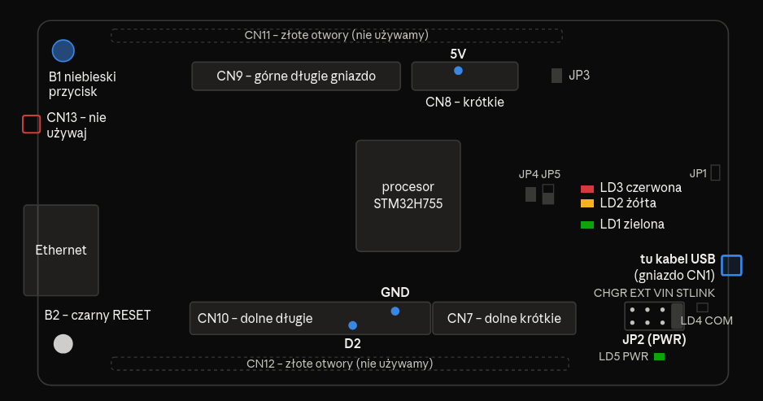

#### Sterowanie żarówką LED za pomocą mikrokontrolera
Program co 10 ms sprawdza godzinę -- od 9:00 do 21:00 podaje napięcie na wyprowadzenie D2, a moduł przekaźnika (elektryczny włącznik sterowany z płytki) zamyka wtedy obwód żarówki zasilanej z zasilacza 24 V prądu zmiennego
### Schemat płytki STM32 NUCLEO-H755ZI-Q
